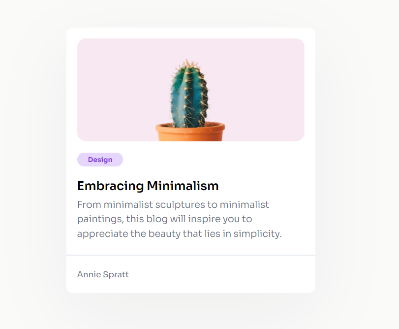

# Card Component

This challenge is a great way to start with basic HTML and CSS skills. The challenge is to create a simple blog card that includes an image, a title, a short description, and a tag.

## Preview

I made this **Challenge** from: [DevChallengues](https://devchallenges.io/challenge/minimal-blog-card "Create a simple blog card")

You can see my **solution** at: [Minimal Blog Card](https://dev-challengues.vercel.app/minimal_blog_card)
